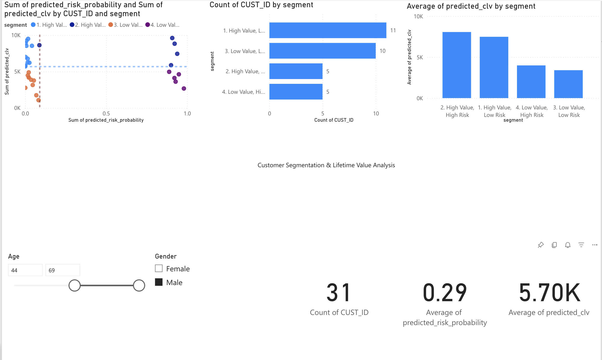

# Credit Risk & Customer Lifetime Value (CLV) Prediction

## Project Overview
This project demonstrates an end-to-end data science workflow to build a framework for predicting credit default risk and estimating customer lifetime value (CLV). Using machine learning models, customers are segmented into four distinct categories, enabling targeted business strategies. The final analysis is presented in an interactive Power BI dashboard.

## Technologies Used
- **Python:** Pandas, NumPy, Scikit-learn, Matplotlib, Seaborn
- **Machine Learning:** XGBoost (for both classification and regression)
- **BI & Visualization:** Power BI
- **Environment:** Google Colab

## Project Structure
- `notebooks/`: Contains the main Jupyter Notebook with all the data processing, model training, and segmentation logic.
- `data/`: Contains the final segmented CSV data used for the Power BI dashboard.
- `dashboard_exports/`: Contains the Power BI file (`.pbix`) and a screenshot of the final dashboard.

## Methodology
1.  **Data Exploration (EDA):** Analyzed the dataset to understand feature distributions and relationships.
2.  **Data Preprocessing:** Handled categorical data using one-hot encoding and scaled numerical features.
3.  **Credit Risk Model:** Trained an XGBoost Classifier to predict the probability of a customer defaulting. Addressed class imbalance using SMOTE.
4.  **CLV Model:** Trained an XGBoost Regressor to predict the Customer Lifetime Value.
5.  **Customer Segmentation:** Combined the outputs of both models to segment customers into a 2x2 matrix:
    - High Value, Low Risk
    - High Value, High Risk
    - Low Value, Low Risk
    - Low Value, High Risk

## Dashboard Preview
Here is a screenshot of the final interactive dashboard built in Power BI.

## How to Run
1.  Clone or download this repository.
2.  Open the `credit_risk_and_clv_analysis.ipynb` file in Google Colab or Jupyter Notebook.
3.  The notebook will generate the `customer_segments_for_power_bi.csv` file.
4.  Open the `credit_risk_dashboard.pbix` file in Power BI Desktop and point it to the newly generated CSV file as its data source.
